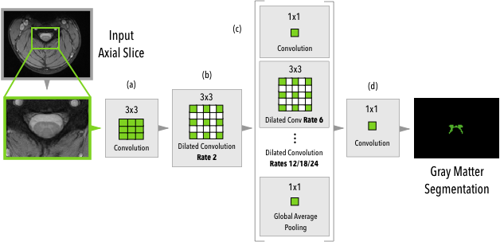
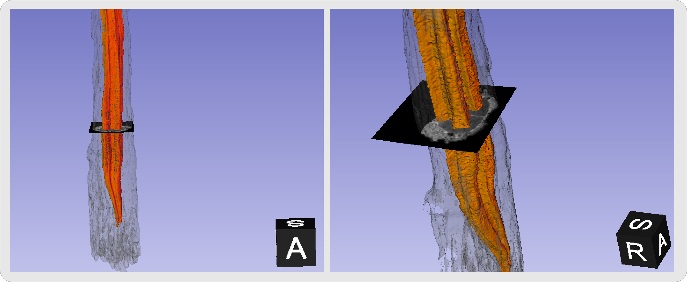

# Spinal cord gray matter segmentation using deep dilated convolutions

[](https://beta.mybinder.org/v2/gh/neuropoly/gmseg/master?filepath=notebooks%2Fchallenge-opensource-model.ipynb)

This repository contains the source-code for the paper "Spinal cord gray matter segmentation using deep dilated convolutions", available as [pre-print on ArXiv](https://arxiv.org/abs/1710.01269).

You can see the MRI *ex-vivo* [segmentation video](https://www.youtube.com/watch?v=9Nz6H-wFCsM). Another
manuscript is under review for the MRI *ex-vivo* data.





# Requirements Installation

To use this repository, you'll need to install the following requirements:

* Clone the repository
* Install Python requirements with `pip install -r pip-requirements.txt`
* Open the Jupyter Notebook located at `notebooks` folder

# Remarks
Some remarks regarding the model:

* This model was trained on a common space with a voxel size of 0.25mm x 0.25mm, so 
  you'll have to resample your data to this space if you want good results;
* This repository contains the model trained on the GM Challenge Dataset (both train and validation),
  the model is located on the directory called `models` together with a json file containing
  the mean/std that was used to standardize the training data;
* For the training procedure, please see the original paper for more information;

## Citation
If you use this work in your research, please cite:

    @article{arxiv1710.01269,
      author = {Christian S. Perone, Evan Calabrese, Julien Cohen-Adad},
      title = {Spinal cord gray matter segmentation using deep dilated convolutions},
      journal = {arXiv preprint arXiv:1710.01269},
      year = {2017}
    }

## License

```
MIT License

Copyright (c) 2017 NeuroPoly

Permission is hereby granted, free of charge, to any person obtaining a copy
of this software and associated documentation files (the "Software"), to deal
in the Software without restriction, including without limitation the rights
to use, copy, modify, merge, publish, distribute, sublicense, and/or sell
copies of the Software, and to permit persons to whom the Software is
furnished to do so, subject to the following conditions:

The above copyright notice and this permission notice shall be included in all
copies or substantial portions of the Software.

THE SOFTWARE IS PROVIDED "AS IS", WITHOUT WARRANTY OF ANY KIND, EXPRESS OR
IMPLIED, INCLUDING BUT NOT LIMITED TO THE WARRANTIES OF MERCHANTABILITY,
FITNESS FOR A PARTICULAR PURPOSE AND NONINFRINGEMENT. IN NO EVENT SHALL THE
AUTHORS OR COPYRIGHT HOLDERS BE LIABLE FOR ANY CLAIM, DAMAGES OR OTHER
LIABILITY, WHETHER IN AN ACTION OF CONTRACT, TORT OR OTHERWISE, ARISING FROM,
OUT OF OR IN CONNECTION WITH THE SOFTWARE OR THE USE OR OTHER DEALINGS IN THE
SOFTWARE.
```